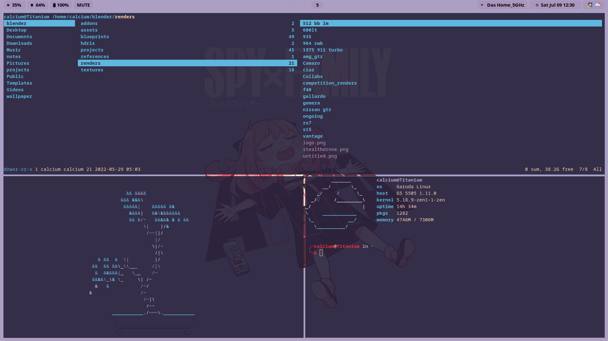
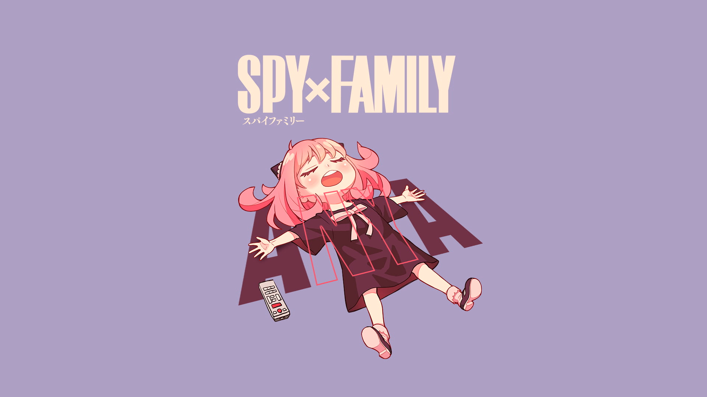

# Anya
Welcome to the Anya desktop. You want a peanut?
# Installation
Copy over the config files that you need and start using!
# Colour palette
Using a custom colour palette consisting of:
1) #B19FC3 - Glossy Grape

2) #27213C - Dark Purple

3) #5DB7DE - Cyan Process

4) #FFD6AF - Light Orange

5) #F02D3A - Imperial Red

I call it the Anya Scheme

# Picture

# Tools Used

WM: [Sway](https://swaywm.org/)

Bar: [Waybar](https://github.com/Alexays/Waybar)

Terminal: [Alacritty](https://github.com/alacritty/alacritty)

Shell: [Fish](https://fishshell.com/)

Prompt: [Starship](https://starship.rs/)

Font: [JetBrains Mono](https://www.jetbrains.com/lp/mono/)

Launcher: [Rofi](https://github.com/davatorium/rofi)

# Wallpaper 

